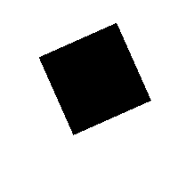
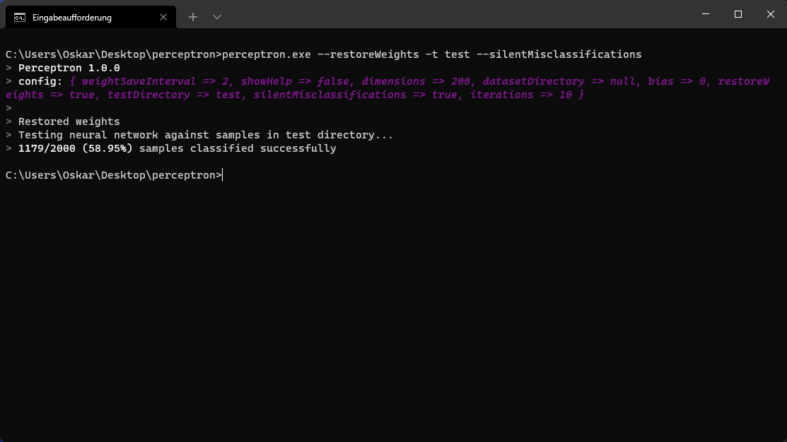

# Perceptron
In machine learning, the perceptron is an algorithm for supervised learning of binary classifiers. A binary classifier is a function which can decide whether or not an input, represented by a vector of numbers, belongs to some specific class.  It is a type of linear classifier, i.e. a classification algorithm that makes its predictions based on a linear predictor function combining a set of weights with the feature vector. ([Wikipedia](https://en.wikipedia.org/wiki/Perceptron))

## Acknowledgements
I trained the algorithm to differentiate between images of squares and stars I generated by modifying the program described in [this article](https://www.sciencedirect.com/science/article/pii/S2352340920309847). After training it for a while, the algorithm seems to reach a plateau at about 60% recognition rate and does not improve noticeably thereafter.

| Star                      | Square                       |
|---------------------------|------------------------------|
|   |  |

## Example
These are the results after training the algorithm with a dataset containing 5000 images of squares and stars for about half an hour on an AMD Ryzen 3 3100 processor. The datset used for training and the one used for testing are completely disjunct. The dataset I used and my pre-trained weights can be downloaded from the [releases tab](https://github.com/oskar2517/perceptron/releases).


## Usage
Images used in datasets must be 24-bit bitmaps (`.bmp`) and must be in black and white only. File names must either start with `0_` or `1_` to be recognized. If `--restoreWeights` is set, weights will be restored from a file called `weights.json` which must be located inside the working directory. This is useful to continue previous training.
```
Usage: perceptron [-options]

Options:
[--help | -h]                     : Shows this dialog
[--dataset | -d] <path>           : Directory containing the dataset used for training
[--test | -t] <path>              : Directory containing samples to be tested against the neural network
[--bias] <bias>                   : Adjusts the bias
[--dimensions] <dimensions>       : Dimensions of the sample images used
[--iterations | -i] <iterations>  : How many training iterations should be performed
[--weightSaveInterval] <interval> : How often the current weights should be saved
[--restoreWeights]                : Whether weights should be restored from weights.json
[--silentMisclassifications]      : Hides misclassification message
```

## Limitations
- Only black and white images are supported.
- Only bitmaps are supported.

## Building
1. Install the latest version of the [Haxe programming language](https://haxe.org/) on your system.
2. Clone this repository (`git clone https://github.com/oskar2517/perceptron`).
3. Open a terminal inside the cloned project.
4. Run `haxe cpp.hxml`.

A stand-alone executable will be created in `build/cpp/`.